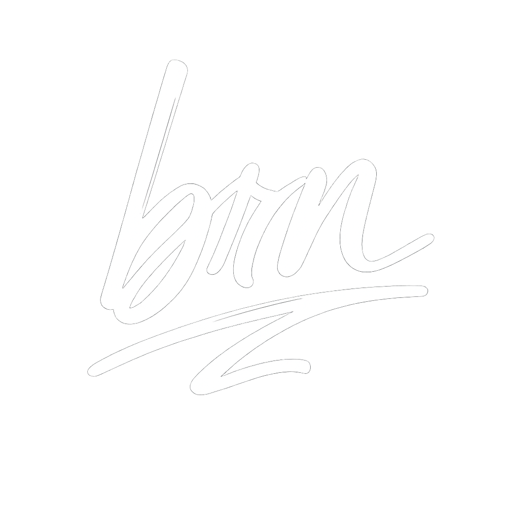

<div align="center">
    
</div>

# 📘 Portfolio – Briaan Betabelet  
Développeur Full‑Stack | Étudiant en Conception & Développement d’Applications

## 🧭 Table of contents
- [About](#description)
- [Technologies](#technologies)
- [Installation](#installation)
- [Usage](#use)
- [Project structure](#project‑structure)
- [License](#license)
- [Contact](#contact)

---

## Description 
This portfolio is designed to present my projects, my technical skills, my academic background and the services I offer.
It aims to provide a professional overview of my profile and my achievements.

---

## Technologies  
This project uses the following technologies:
- HTML, CSS, JavaScript
- PHP (for certain dynamic parts)
- Deployment: GitHub Pages
- Versioning system: Git


<p align="right">(<a href="#readme-top">back to top</a>)</p>


---

## Demonstration
👉 [See the site online](https://brnbt.github.io/portfolio/)

## Installation
```bash
# Clone the repository
git clone https://github.com/Brnbt/portfolio.git

# Move within the folder
cd portfolio
```

Then open the `index.html` file in your browser — no additional installation required (static site).

---

## Usage
- Modify the contents (text, images) in the corresponding folders.
- Add or remove sections as needed.
- Deploy via GitHub Pages or other static site hosting.
---

## Project structure
```
portfolio/
│
├── doc/ # PDF document
├── img/ # Images
├── styles.css # Stylesheets
├── scrpit.js # JavaScript Scripts
├── index.html # Home page
└── README.md # This file
```

---

## Licence  
This project is licensed under no license.

---

## Contact  
- **Email :** briaan.betabelet@gmail.com  
- **LinkedIn :** [linkedin.com/in/briaan-betabelet](https://linkedin.com/in/briaan-betabelet)  
- **GitHub :** [github.com/Brnbt](https://github.com/Brnbt)

---

Thank you for visiting this portfolio.
